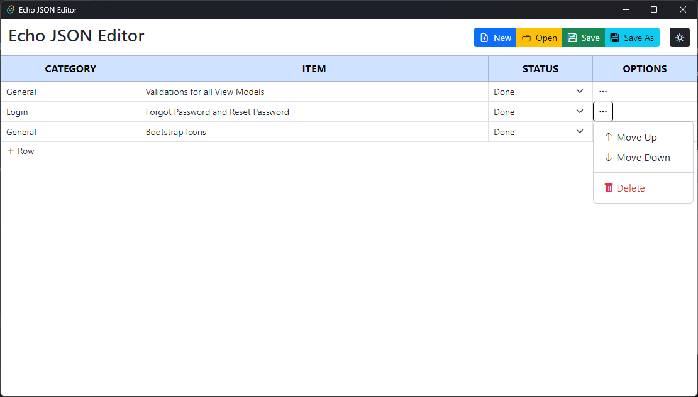
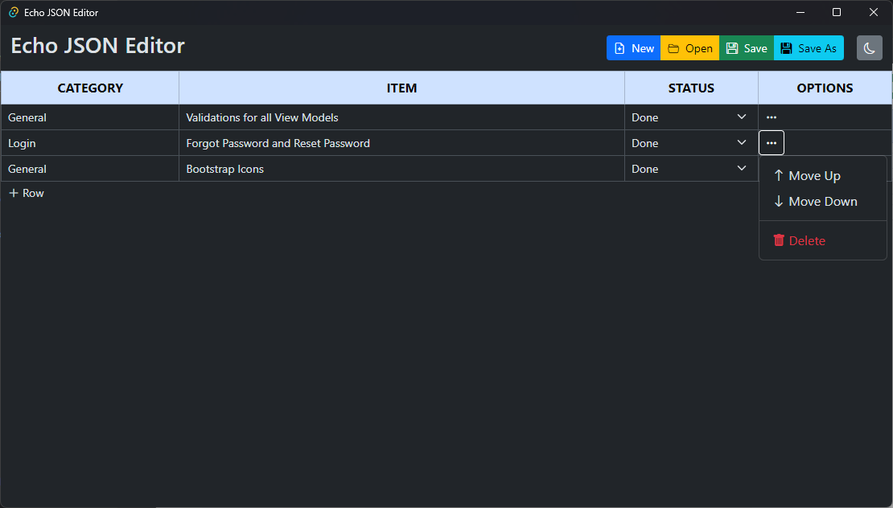

# Echo

A Simple Lightweight Todo List Editor using React/Typescript and Tauri/Rust. 

Echo can be used to create, edit, delete and manage todo lists. You can even save your todo lists to a JSON file and load them back later.

> Currently Work in Progress.

## Features

- Create, Edit, Delete Todo Lists
- Save and Load Todo Lists to JSON file
- Basic Hotkeys for quick navigation
- Dark and Light Mode
- Cross Platform (Windows and macOS - Linux is currently untested)

## Installation

- Will be available soon. For now, you can follow the steps from Tauri's [Docs](https://tauri.app/v1/guides/).

## Hotkeys

- `Ctrl + Shift + N` - Create New Todo List
- `Ctrl + N` - Create New Todo Item
- `Ctrl + O` - Load Todo List from File
- `Ctrl + S` - Save Todo List
- `Ctrl + Shift + S` - Save Todo List As
- `Ctrl + W` - Close Todo List (Asks for Save if changes are made)
- `Ctrl + Shift + W` - Force Close Todo List (Does not ask for Save)
